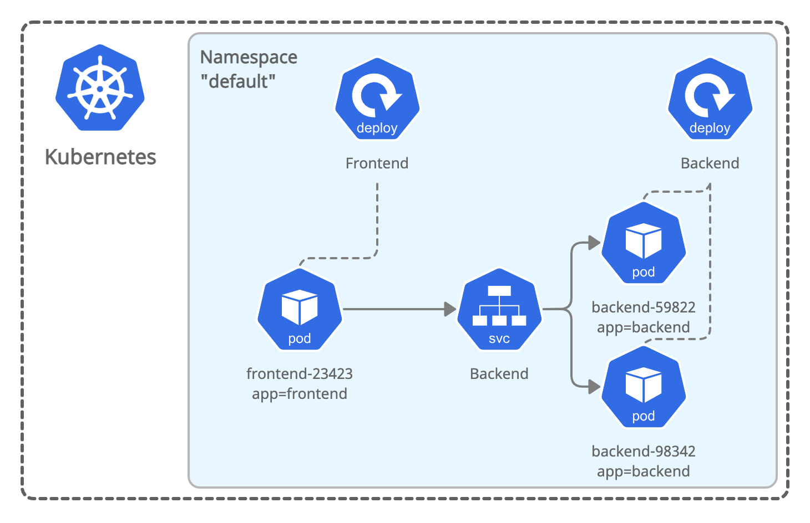

# Setup

## Create a Kubernetes Cluster

### GKE

    export CLUSTER_NAME=test-$(whoami)-$RANDOM
    export CLUSTER_ZONE=us-west2-a
    gcloud container clusters create $CLUSTER_NAME --image-type COS --num-nodes 2 --machine-type n1-standard-4 --zone $CLUSTER_ZONE
    gcloud container clusters get-credentials $CLUSTER_NAME --zone $CLUSTER_ZONE

### minikube

    minikube start --network-plugin=cni

## Install CNI with NetworkPolicy capability

### Cilium

#### Darwin

    curl -LO https://github.com/cilium/cilium-cli/releases/download/v0.4/cilium-darwin-amd64.tar.gz
    tar xzvf cilium-darwin-amd64.tar.gz
    sudo mv cilium /usr/local/bin
    cilium install
    cilium status

#### Linux

    curl -LO https://github.com/cilium/cilium-cli/releases/download/v0.4/cilium-linux-amd64.tar.gz
    tar xzvf cilium-linux-amd64.tar.gz
    sudo mv cilium /usr/local/bin
    cilium install
    cilium status


## Deploy Demo App

Create the following demo-app in your Kubernetes cluster. The examples will assume that you deploy the demo app into the `default` namespace but you can of course use any namespace and adjust the examples accordingly.
``` bash
kubectl create -f demo-app.yaml
```



Validate that you have `frontend` and `backend` pods running:
``` bash
kubectl get pods,svc
NAME                            READY   STATUS    RESTARTS   AGE
pod/backend-69d87c4548-kx4sz    1/1     Running   0          8m18s
pod/frontend-6864ff68cc-7r2fc   1/1     Running   0          8m18s

NAME                 TYPE        CLUSTER-IP      EXTERNAL-IP   PORT(S)    AGE
service/backend      ClusterIP   10.100.105.40   <none>        8080/TCP   8m19s
```

In order to simplify execution of commands in the pods, store the pod names in shell variables:

``` bash
FRONTEND=$(kubectl get pods -l app=frontend -o json | jq -r '.items[0].metadata.name')
BACKEND=$(kubectl get pods -l app=backend -o json | jq -r '.items[0].metadata.name')
```

Finally, validate that the `frontend` pod can talk to the `backend` pod:

``` bash
kubectl exec -ti $FRONTEND -- curl -I backend:8080 | head -1
HTTP/1.1 200 OK
```
