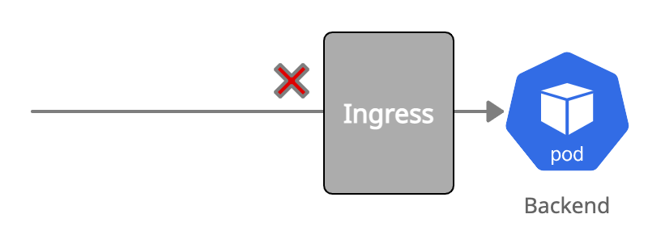

# Ingress Default Deny



``` yaml
kind: NetworkPolicy
apiVersion: networking.k8s.io/v1
metadata:
  name: backend-ingress-deny
spec:
  podSelector:
    matchLabels:
      app: backend
  policyTypes:
  - Ingress
```
[*View in the Policy Editor*](https://editor.cilium.io/?policy-url=https://raw.githubusercontent.com/networkpolicy/examples/master/gettingstarted/01-backend-ingress-deny.yaml)

### Try this policy

Create this policy in your [cluster running the demo app](00-setup.md):

``` bash
kubectl create -f 01-backend-ingress-deny.yaml
```

A connection from `frontend` to `backend` will now timeout:

``` bash
kubectl exec -ti $FRONTEND -- curl -I --connect-timeout 5 backend:8080
curl: (28) Connection timed out after 5001 milliseconds
command terminated with exit code 28
```

However, the `backend` can still reach kubernetes.io:

``` bash
kubectl exec -ti $BACKEND -- curl -I kubernetes.io | head -1
HTTP/1.1 301 Moved Permanently
```
