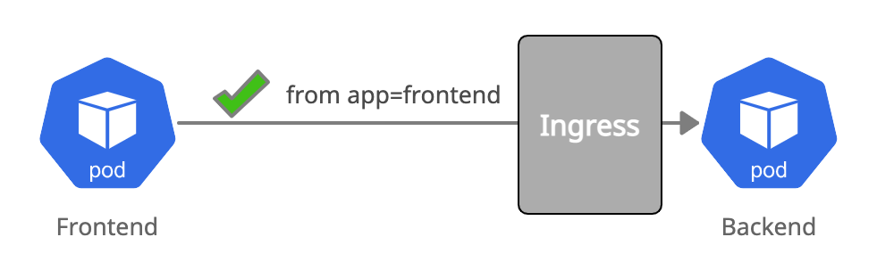

# Allow Pod to Pod Ingress



``` yaml
kind: NetworkPolicy
apiVersion: networking.k8s.io/v1
metadata:
  name: backend-ingress-allow-frontend
spec:
  podSelector:
    matchLabels:
      app: backend
  ingress:
    - from:
      - podSelector:
          matchLabels:
            app: frontend
```

Create the above policy in your cluster:

``` bash
kubectl create -f 02-backend-ingress-allow-frontend.yaml
```

A connection from `frontend` to `backend` will now succeed:
``` bash
kubectl exec -ti $FRONTEND -- curl -I backend:8080 | head -1
HTTP/1.1 200 OK
```
