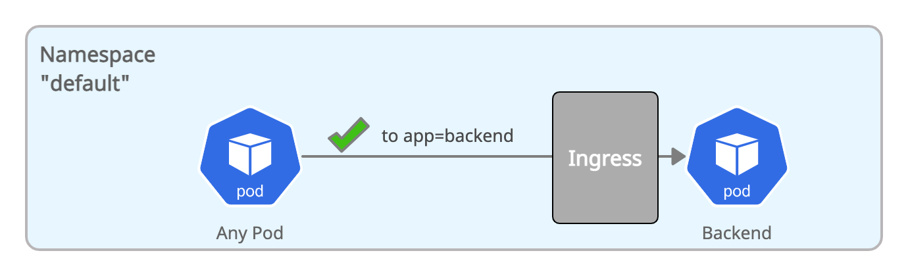

# Allow Ingress within Namespace



```yaml
apiVersion: networking.k8s.io/v1
kind: NetworkPolicy
metadata:
  name: all-pods-ingress-allow-within-namespace
spec:
  podSelector: {}
  ingress:
    - from:
      - podSelector: {}
```


Create the above policy in your cluster:
``` bash
kubectl create -f 03-all-pods-allow-within-namespace.yaml
```


A connection from `frontend` running in the same namespace as `backend` will now succeed:
``` bash
kubectl exec -ti $FRONTEND -- curl -I backend:8080 | head -1
HTTP/1.1 200 OK
```
