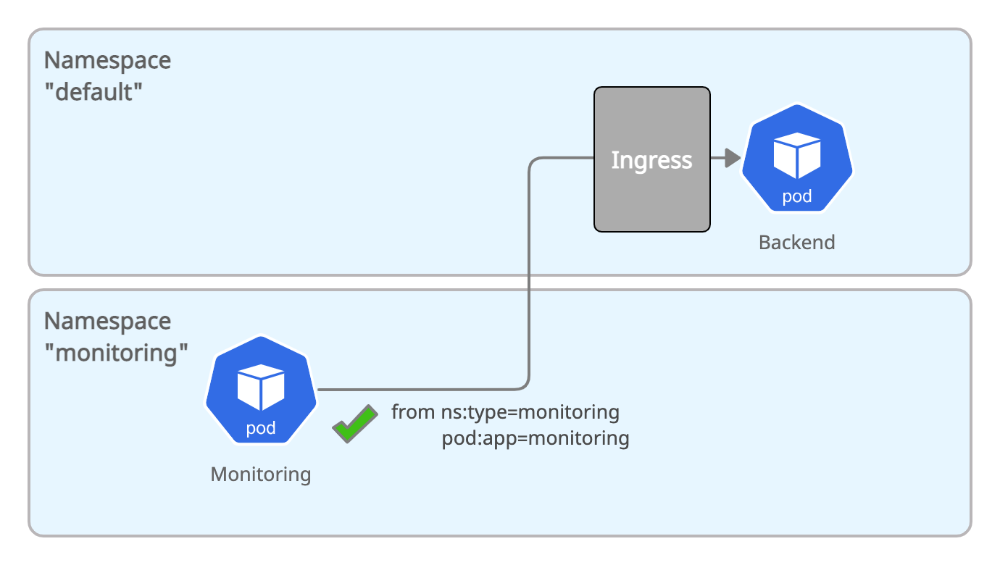

# Allow specific Pods from other Namespaces



``` yaml
apiVersion: networking.k8s.io/v1
kind: NetworkPolicy
metadata:
  name: backend-ingress-allow-monitoring-namespace
spec:
  podSelector:
    matchLabels:
      app: backend
  ingress:
    - from:
        - namespaceSelector:
            matchLabels:
              type: monitoring
          podSelector:
            matchLabels:
              app: monitoring
```

Create the policy in your cluster:

``` bash
kubectl create -f 05-backend-ingress-allow-monitoring-app.yaml
```


A pod with label `app=monitoring` in a namespace with the label `type=monitoring` can now access `backend:`

``` bash
kubectl create namespace monitoring
kubectl label namespace monitoring type=monitoring
kubectl -n monitoring create -f monitoring-app.yaml
MONITORING=$(kubectl -n monitoring get pods -l app=monitoring -o json | jq -r '.items[0].metadata.name')
```

``` bash
kubectl -n monitoring exec -ti $MONITORING -- curl -I backend.default.svc.cluster.local:8080 | head -1
HTTP/1.1 200 OK
```

