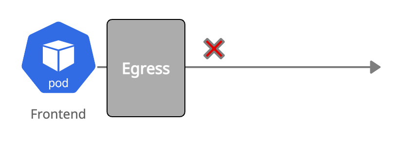

# Egress Default Deny



```yaml
kind: NetworkPolicy
apiVersion: networking.k8s.io/v1
metadata:
  name: frontend-egress-deny
spec:
  podSelector:
    matchLabels:
      app: frontend
  policyTypes:
  - Egress
```

Create the egress default deny policy and validate that the `frontend` pod can't reach the `backend` pod anymore:
``` bash
kubectl create -f 06-frontend-egress-deny.yaml
```

Test that `frontend` cannot reach `backend`:
``` bash
kubectl exec -ti $FRONTEND -- curl -I --connect-timeout 5 backend:8080 | head -1
curl: (28) Resolving timed out after 5000 milliseconds
command terminated with exit code 28
```
