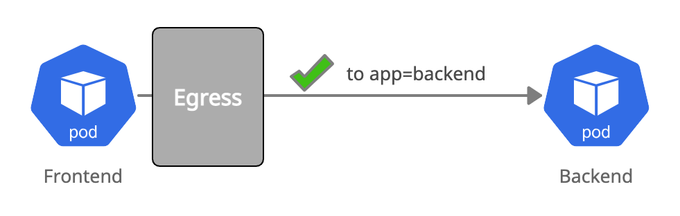

## Allow Egress Pod to Pod



```yaml
kind: NetworkPolicy
apiVersion: networking.k8s.io/v1
metadata:
  name: frontend-egress-allow-to-backend
spec:
  podSelector:
    matchLabels:
      app: frontend
  policyTypes:
  - Egress
  egress:
    - to:
      - podSelector:
          matchLabels:
            app: backend
```

**Note:** This policy alone is insufficient to allow pod to pod. You also need to allow DNS, see [08-frontend-egress-allow-dns](08-frontend-egress-allow-dns.md)

Create the policy in your cluster:

``` bash
kubectl create -f 07-frontend-egress-allow-to-backend.yaml
```


The `frontend` pod can now talk to a `backend` pod in the same namespace:
```bash
kubectl exec -ti $FRONTEND -- curl -I backend:8080 | head -1
HTTP/1.1 200 OK
```
