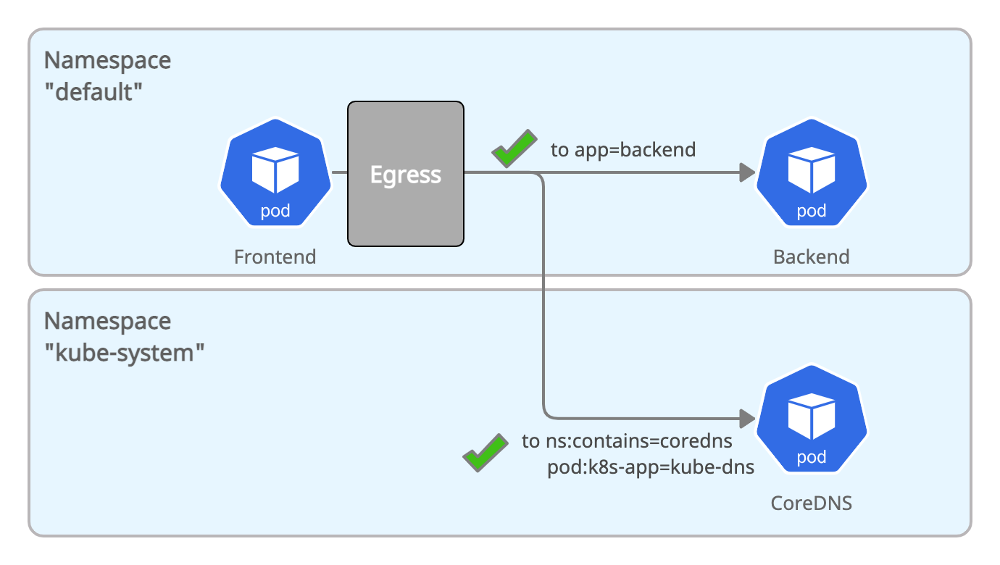

# Allow Kubernetes DNS



```yaml
kind: NetworkPolicy
apiVersion: networking.k8s.io/v1
metadata:
  name: all-pods-egress-allow-dns
spec:
  podSelector: {}
  policyTypes:
  - Egress
  egress:
    - to:
      - namespaceSelector:
          matchLabels:
            contains: coredns
        podSelector:
          matchLabels:
            k8s-app: kube-dns
```

As CoreDNS is running in a different namespace, the policy has to include both a `namespaceSelector` and a `podSelector`. In order to remain flexible, the namespace is selected with a labels `contains: coredns` which you will have to add to the namespace in which CoreDNS is running in. If CoreDNS is ever moved to a different namespace, setting the label on the namespace will be sufficient and the policy won't break.

1. Add the `contains: coredns` label to the `kube-system` namespace:

    ```bash
     kubectl label namespace kube-system contains=coredns
     ```

2. Create the policy `all-pods-egress-allow-dns`:

    ```bash
    kubectl create -f 08-all-pods-egress-allow-dns.yaml
    ```

3. Validate that the `frontend` pod can now perform DNS lookups and reach the `backend` pod:

    ```bash
     kubectl exec -ti $FRONTEND -- curl -I backend:8080 | head -1
     HTTP/1.1 200 OK
    ```
